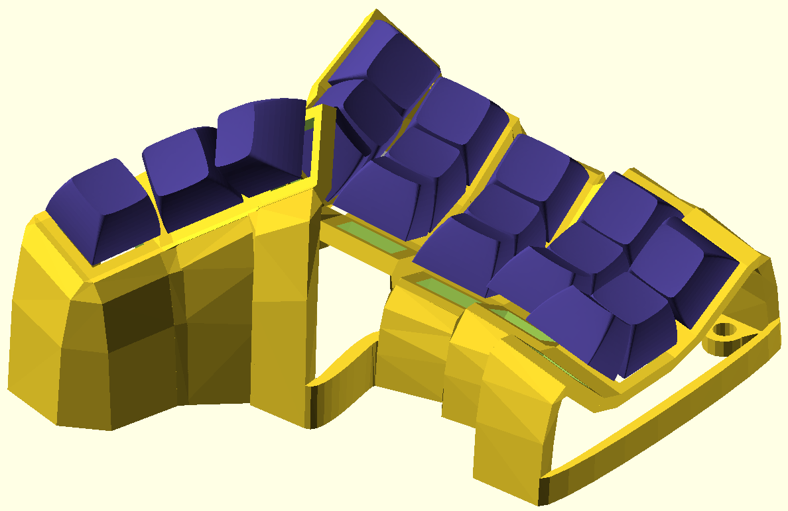
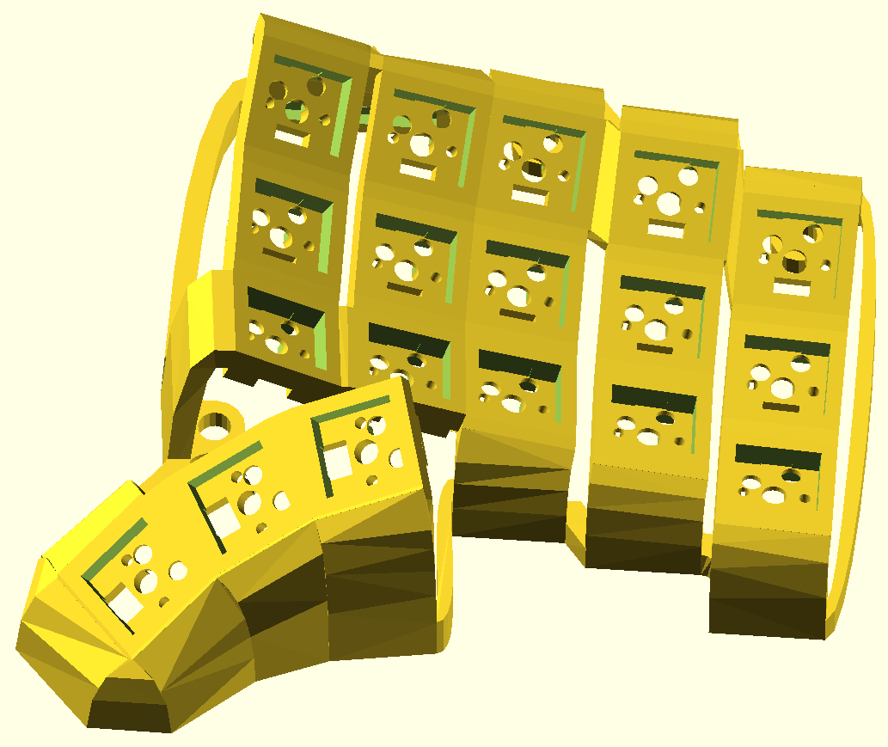
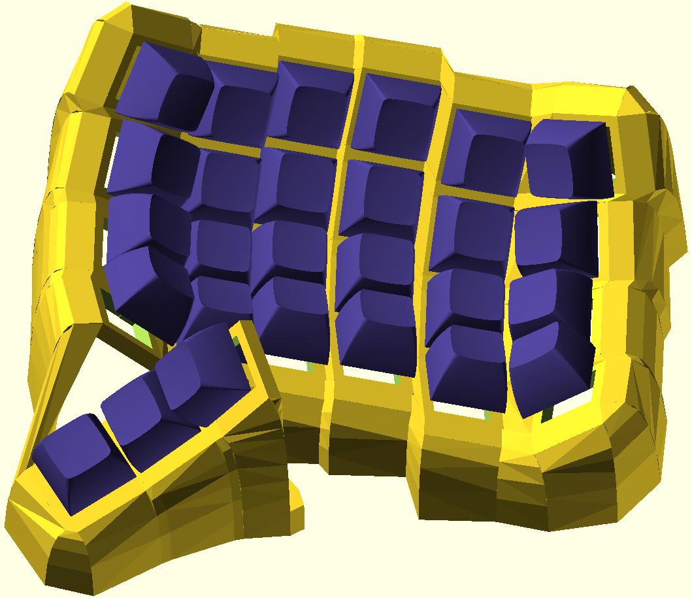

# Dometyl - Another Dactyl inspired keyboard (eventually supporting rubber domes)

## About
This is a library (currently under construction) for generation of paramaterized
split-hand, concave, columnar, ergonomic keyboards in the spirit of the
[Dactyl](https://github.com/adereth/dactyl-keyboard), but written in from the
ground up in [ocaml](https://ocaml.org/), rather than
[clojure](https://clojure.org). **Dometyl** also takes inspiration from a
lineage of **Dactyl-like** keyboards that evolved from the original script,
including the [Compactyl](https://github.com/dereknheiley/dactyl-manuform-tight)
itself a fork of forks of dactyl-manumform keyboards with many accumulated
features, and the [Skeletyl](https://github.com/Bastardkb/Skeletyl), a sleak,
low-profile, open-case design built in
[Fusion360](https://www.autodesk.ca/en/products/fusion-360/overview).

The name **Dometyl** comes from my original mission of creating a
**dactyl/skeletyl-like** board that can be built with rubber dome switches like
[Topre](https://deskthority.net/wiki/Topre_switch) (or
[Niz](https://www.nizkeyboard.com/products/2019-new-niz-ec-switch), whose top
switch housings are available to purchase). The planned switching mechanism
using magnets and cheap hall-effect sensors rather than the typical capacitive
sensor PCBs works as expected in hand (images and video of prototype assembly to
come), however a sturdy enough and relible mounting scheme for dome and sensor
platform to the bottom of the plate is yet to be worked out (WIP parts can be
found in the [Niz module](dometyl/lib/generator/niz.ml)).

In the meantime, the generator works fine for Mx and Choc style switches, so I
am working to improve the documentation and make it a bit more user friendly so
that others can begin to tool around with it.

## Setup
This generator is written in the [ocaml](https://ocaml.org/) language, so you'll
need to get an environment set up, including the package manager
[opam](https://opam.ocaml.org/) and the build system
[dune](https://github.com/ocaml/dune). You'll of course also want
[OpenSCAD](https://openscad.org/) to preview/render/export the generated models.

### Installing Scad_ml
One day I may get to upstreaming my drammatic changes to
[scad-ml](https://github.com/namachan10777/scad-ml) and do the work to get the
library added to the **opam** repository, but for now, you'll need to clone and
locally install my fork.
1. `git clone https://github.com/geoffder/scad-ml`
2. `cd scad-ml`
3. `opam install ./scad_ml.opam`

### opam dependencies
The other dependencies are [base](https://github.com/janestreet/base) (standard
library replacement) and [stdio](https://github.com/janestreet/stdio) from
janestreet, both of which are available through the opam package manager.
* `opam install base stdio`

## Organization
Online documentation is available
[here](https://geoffder.github.io/dometyl-keyboard/dometyl/index.html), and will
be filling in over time.

## Usage
1. Make a new `.ml` file in the [boards library](dometyl/lib/boards), or
   modify and existing one to suit your preferences / fit your hand.
2. Add a line (or make sure one exists) for writing the scad of your generated
   model to [main.ml](dometyl/bin/main.ml), which will be run when executing
   `dometyl`. This can be done simply with the helper function `write_thing`
   which can also optionally export and `.stl` using the OpenSCAD cli. You can
   also pass your generated `Case.t` to tent and bottom plate generation
   functions while you're there and write those to `.scad` as well.
3. Generate scads/stls by running `dune exec @dometyl` from the [dometyl](dometyl)
   project folder. Files will be output to the [things](things) directory.
4. Open generated `.scad` files in OpenSCAD where they can be
   previewed/rendered/exported to `.stl`. If a viewed `.scad` is overwritten by
   compiling and running the generator, the changes will be visible in the GUI.
5. Once you've had success building your board your unique board, and have found
   your new changes to be comfortable (e.g. cool new thumb cluster, tailored
   splays, column tilts, a new look squeezed out of this jank library, etc),
   consider making a PR for your addition to the [boards
   library](dometyl/lib/boards). It would be nice to accumulate a zoo of
   configurations that can serve as jumping off points / inspiration for others.
6. PRs for added/improved functionality in the rest of the library that go
   beyond new combinations of the existing tools are welcomed as well. I know
   that it might be overly optimistic, but I think accumulating improvements and
   variations here rather than having them strewn over countless forks would be
   make for a nice resource!

## More Example Output
* An ugly [recreation](dometyl/lib/boards/skeletyl.ml) (yellow) of the
  [BastardKB Skeletyl](https://github.com/Bastardkb/Skeletyl) (purple).
  
* This mimic configuration can serve as a nice place to start if you like the
  skeletyl, but would like to tweak the column offsets, or would like to (at the
  price of it being a bit taller) use kailh hotswap sockets:
  
* (Mostly) closed [configuration](dometyl/lib/boards/deractyl.ml) with thumb and plate based off of the
  [Compactyl](https://github.com/dereknheiley/dactyl-manuform-tight), but with
  the addition of aggresive secondary column tilt.
  

## License
Copyright © 2021 Geoff deRosenroll

The source code for generating the models is distributed under the [GNU AFFERO
GENERAL PUBLIC LICENSE Version 3](LICENSE.md).

The generated models are distributed under the [Creative Commons
Attribution-ShareAlike 4.0 International (CC BY-SA 4.0)](LICENSE-models.md).
