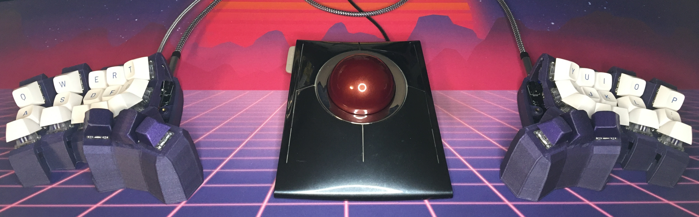
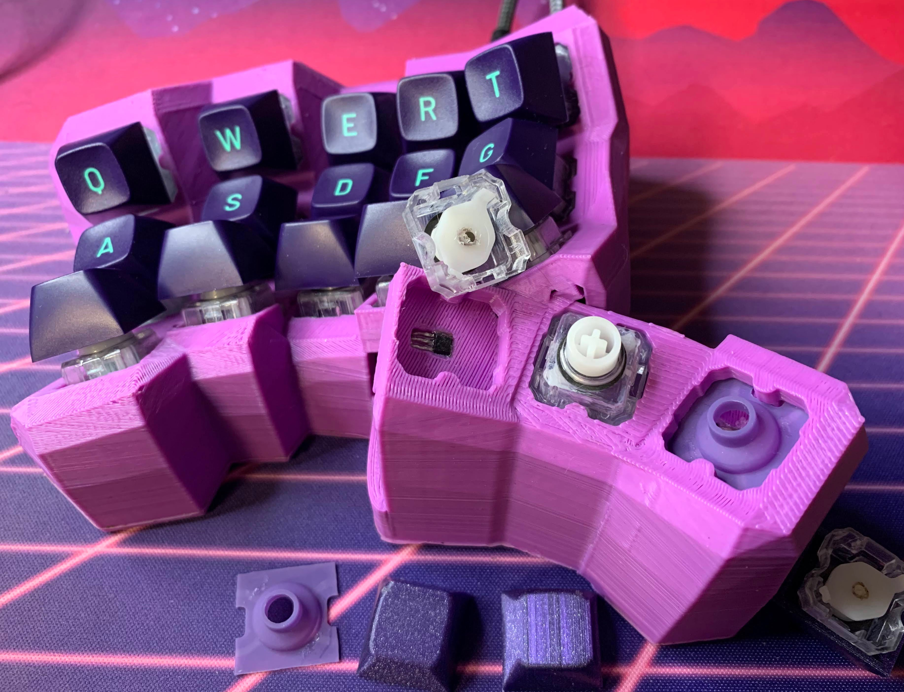
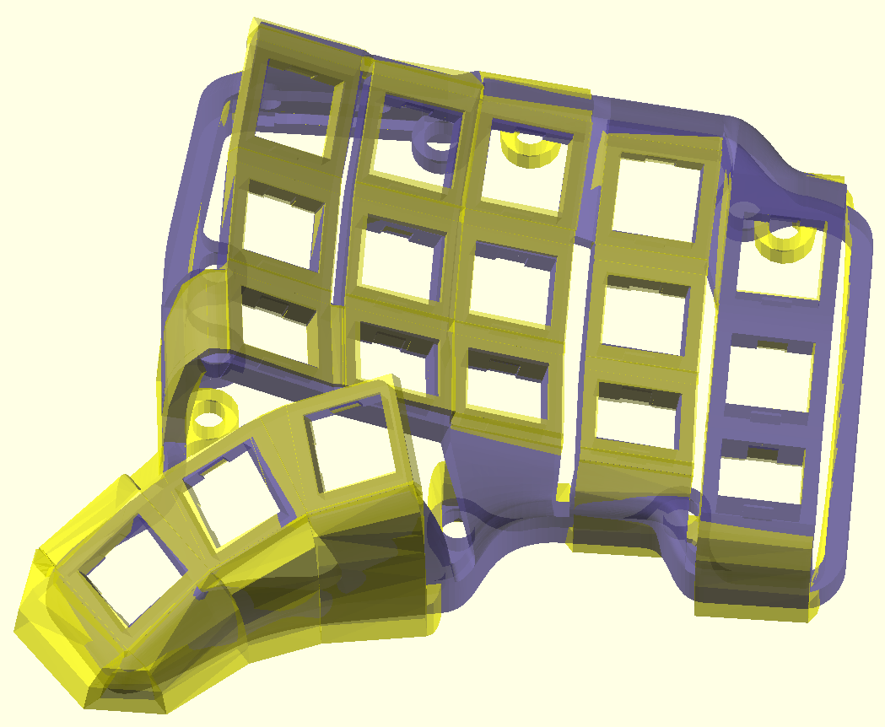
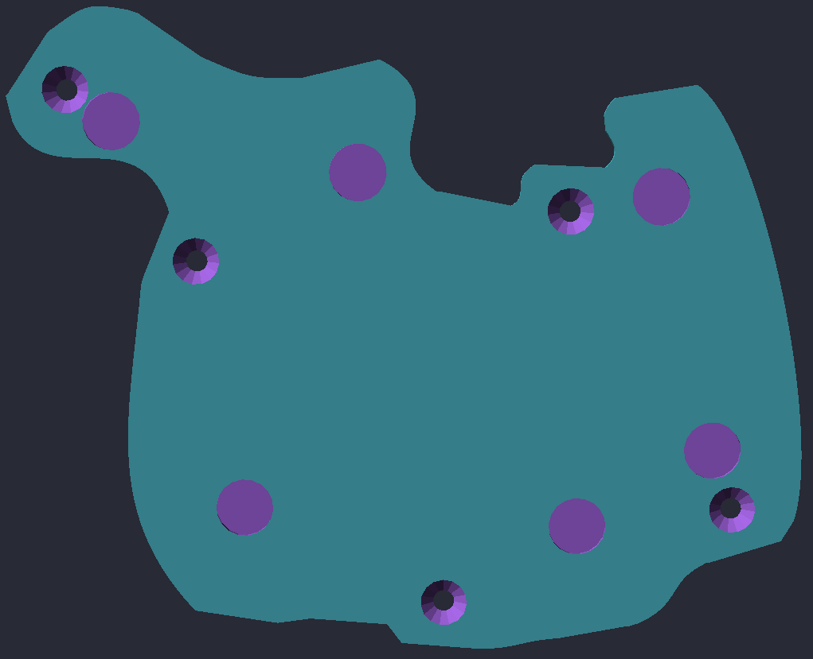
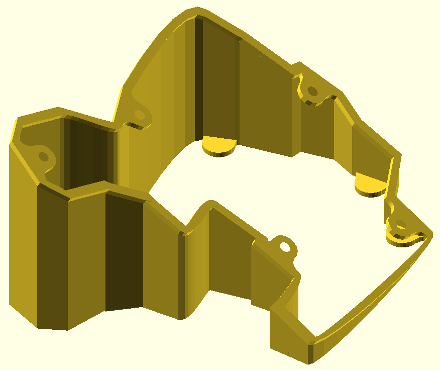
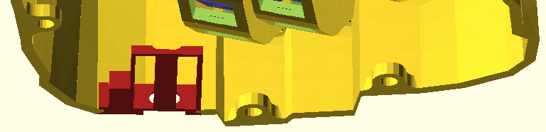
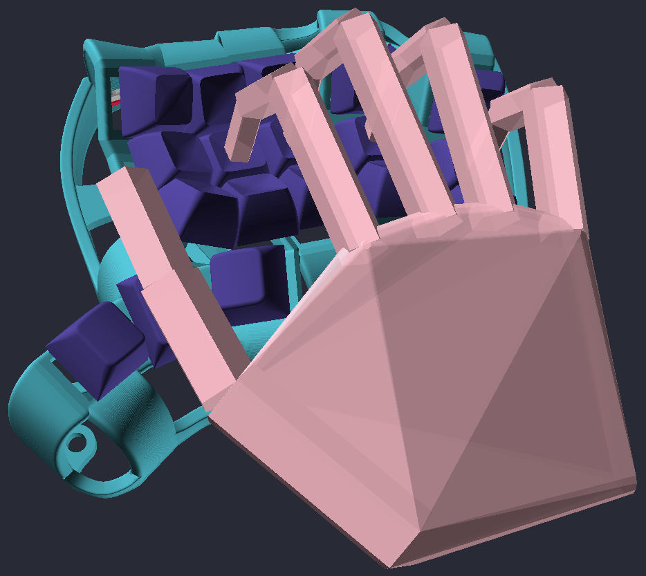

# Dometyl Keyboard

## Another Dactyl inspired keyboard. Supporting MX, Choc, and even rubber domes.
This is a library for generating paramaterized split-hand, concave, columnar,
ergonomic keyboards in the spirit of the
[Dactyl](https://github.com/adereth/dactyl-keyboard), but written from the
ground up in [ocaml](https://ocaml.org/), rather than
[clojure](https://clojure.org). **Dometyl** also takes inspiration from a
lineage of **Dactyl-like** keyboards that evolved from the original script,
including the [Compactyl](https://github.com/dereknheiley/dactyl-manuform-tight)
itself a fork of forks of dactyl-manuform keyboards with many accumulated
features, and the [Skeletyl](https://github.com/Bastardkb/Skeletyl), a sleak,
low-profile, open-case design built in
[Fusion360](https://www.autodesk.ca/en/products/fusion-360/overview).

The name **(rubber) dometyl** comes from this library's introduction of a means
of building split-hand concave keyboards with rubber domes. Taking advantage of
the readily available [Niz housing and
sliders](https://www.nizkeyboard.com/products/2019-new-niz-ec-switch), and
third-party non-sheet rubber domes (e.g. [DES BKE
DOMES](https://www.apexkeyboards.ca/products/des-domes-bke-tactile)), we can
build dome-with-slider switches of our own without canabilizing an existing
Topre or Niz board. You may be thinking that we still need expensive to obtain
conical springs, and difficult to design (and *very* difficult to make use of
inside a curved case) electro capacitive sensing PCBs to complete the picture,
but then you would be wrong! One need simply glue magnets to sliders, and glue
[hall-effect sensors](https://www.diodes.com/assets/Datasheets/AH3572.pdf) into
a case, and *voila* the rubber dometyl is born.

The relevant code for generating the required keyhole can be found in the [Niz
module](lib/niz.ml), the first example of a board
configuration using them [here](models/examples/niztyl.ml), and the build
showcase for it [here](things/legacy/niztyl).

Of course, if you aren't an insane person, the dometyl generator also supports
more civilized Mx and Choc switch options.

## Setup
This generator is written in [ocaml](https://ocaml.org/), so you'll need to get
an environment set up, including the package manager
[opam](https://opam.ocaml.org/) and the build system
[dune](https://github.com/ocaml/dune) (which we'll install through opam). You'll
of course also want [OpenSCAD](https://openscad.org/) to preview/render/export
the generated models (see [OpenSCAD configuration](#openscad-configuration) for tips).

After installing `opam`, and confirming that you are in this branch, you can run
the [setup.sh](setup.sh) script for convenience, or follow the instructions
under the [opam dependencies](#opam-dependencies) sub-section.

### opam dependencies
All dependencies are available from the opam package manager including the build
system [dune](https://github.com/ocaml/dune), and of course
[OCADml](https://github.com/OCADml/OCADml),
[OSCADml](https://github.com/OCADml/OSCADml)
and [ppx_deriving_cad](https://github.com/OCADml/ppx_deriving_cad) for the
modelling. I'd also recommend that you pick up the listed dev tools (which
you'll want to get the corresponding packages/plugins for in your editor of
choice).

**Required:**
From this folder (repo root):
* `opam install . --deps-only --with-doc`
* `dune build`

**Highly recommended for dev experience:**
* `opam install merlin ocp-indent ocaml-lsp-server ocamlformat ocamlformat-rpc`

## OpenSCAD configuration
It is **highly recommended** that you use a [development snapshot](https://openscad.org/downloads.html) of OpenSCAD,
rather than whatever version your package manager may have for you. Then under
the `Features` tab in `Edit/Preferences` and check the following:
- `fast-csg`, `fast-csg-trust-corefinement`, `fast-csg-remesh`,
  `fast-csg-remesh-predictability`, `lazy-union`, `vertex-object-*`
The newly added `fast-csg` and related features speed up rendering considerably,
making the development cycle much more pleasant

## Documentation
API documentation and usage guides are available
[online](https://geoffder.github.io/dometyl-keyboard/dometyl/index.html).

## Usage
1. Make a new `.ml` file in [models](models), maybe
   starting with a copy of and existing one and and modifying it to suit your
   preferences / fit your hand.
2. Modify [main.ml](models/main.ml), adding lines to generate and write
   your case models/parts to file with `Scad.to_file`.
3. Run your [main.ml](models/main.ml) with `dune build @models` from the [dometyl](dometyl)
   project folder. Any `.scad` files produced will then appear in the
   [models](models/scads) directory. For a more fluid experience, you
   can install `fswatch` (cross-platform) or `inotify` (GNU/linux) on your
   system, and use `dune build -w @models` to automatically build and execute on
   file changes.
4. Open generated `.scad` files in OpenSCAD where they can be
   previewed/rendered/exported to `.stl`. If a viewed `.scad` is overwritten by
   compiling and running the generator, the changes will be visible in the GUI.

### Direct Export
`dune build @export_models` is also made available for convenient batch `stl`
export. When run, this rule will call out to the `openscad` cli (assumed to be
installed on your system) to asynchronously export *all* of the `scad` files in
[models](models/scads) directory to `stl` models in the
[models](models/stls) directory at once.

**Note:**
- Enabling `fast-csg` and the like is not currently supported by the `OSCADml`
  CLI helpers.
- STL export can take quite a while (which is why this can be helpful) and
 consume a lot of resources, so one should be mindful of what one is signing up
 for by building this rule.
- Unfortunately, CLI export sometimes fails in CGAL when the same model would
 pass via the GUI.

## Example Output
* An uglier [recreation](models/examples/skeletyl.ml) (yellow) of the
  [BastardKB Skeletyl v4](https://github.com/Bastardkb/Skeletyl) (purple).
  
  This configuration can be a good place to start if what you are looking for is
  minor tweaks to more "standard" dactyl-like curvatures and offsets (or you want hotswap
  sockets).
* Configurable heat-set insert screw holes, magnet insets, or bumpon feet can be
  placed at the base of walls of your choosing 
* Base plates and configurable tents can be generated to fit your case, using
  either screws (into brass insets in the case), or magnets for mounting.
  
  

## Builds / STLs
There is a showcase of finished builds and some example STLs [here](things), including some
pictures, bills of materials, and notes. If you've designed and built a board
with the dometyl generator, and you are happy with it, please consider contributing the
configuration to the [models](models) directory, and adding a folder
to the [boards showcase](things).

## MCU / TRRS jack holders
* A few solutions for MCU (elite-C and pro-micro currently) and TRRS jack
  mounting are available at the moment. Rough placement is done with the help of
  coordinates kept within the records of the `Case.t` type, with offset and
  rotation parameters available to fine-tune.
* Firstly, there is support for using the familiar slot-in trays from
  [dereknheiley](https://github.com/dereknheiley/dactyl-manuform-tight)
  (reversible, elite-C without and without reset button access) and
  [carbonfet](https://github.com/carbonfet/dactyl-manuform) (non-reversible,
  elite-C and pro-micro). Eventually a more tailored tray holder that should be
  available, but these existing stls can get the job done today.
  
  
* Second, the [BastardKB shield
  pcb](https://github.com/Bastardkb/Elite-C-holder) used in the
  [Skeletyl](https://github.com/Bastardkb/Skeletyl) (as well Quentin's other
  boards) is supported as well. In addition to making the required insets/holes
  in the case, the included helper functions will place configurable eyelets for
  heatset inserts for mounting.  
  Some time ago, I ordered way too many of these off of JLCPCB, so if you are in
  NA, something could likely be arranged! Alternatively, if would like to use
  this mounting method rather than one of the trays, and you don't want get PCBs
  made, there is an [stl](assets/mcu_holders/bastardkb/printable_shield_right.stl)
  available which you can print and solder your components around / glue to.
* When using one of the trays, be mindful that the rails/slots are cut nicely in
  the wall, and for an option that cuts ports into the wall, be sure that they
  don't start too far away from the outside, so that the plugs will be able to
  reach. `Walls.make` has an `index_scale` parameter so that these
  holder-relevant walls can be tuned separately from the rest to adapt to your
  chosen mounting method.

## The Hand

There is an as yet undocumented (and subject to evolution) [Hand
module](lib/hand.ml) available to play around with. One can
generate hand from knuckle (base of proximal bones, or the meta-carpal for the
thumb) offset coordinates and bone lengths, then pose it with the available
flexion/extension/abduction/adduction/etc functions, and place it over the home
row of a generated `Plate.t`. Hopefully this can help give you a sense of what
column offsets and curvatures are going to work for you before you commit to a
test print.

## Troubleshooting
Now and then, when you attempt to render a model, part of it will disappear.
This is due to my imperfect abuse of
[OpenSCAD
polyhedrons](https://en.m.wikibooks.org/wiki/OpenSCAD_User_Manual/Primitive_Solids#polyhedron),
which can sometimes self-intersect despite the so-far built-in preventative
efforts. The walls (from keyholes to the ground) and the connections between the
walls both use polyhedrons so they are prone to breaking in this manner.

When this happens, and more than one piece of the case disappears (e.g. all of the
connections between the walls), it can be useful to narrow down which part(s) in
particular caused it, since it isn't necessarily all of them that have gone bad.
To help with this, you can use **Thrown Together** mode in the OpenSCAD GUI
(found in the **View** menu, or activated by hitting **F12**), which will show
pink where you can see into the inside of any shapes (unclosed mesh).

Generally, you should be able to fix the problem by adjusting the parameters
used for drawing the polyhedrons in question, such as scaling walls to prevent
them overlapping with eachother, adjusting resolution with `~fn` parameters, etc.

## Contributing
Contributions extending the functionality of the library (in addition to board
configurations as mentioned above) are welcome. If you plan to make a PR, please
have autoformatting working with your editor working (using the `.ocamlformat`
profile included in this repo) beforehand, and ammend/write doc comments in the
relevant interface files (already not 100% as is).

## License
Copyright © 2023 Geoff deRosenroll

The source code for generating the models is distributed under the [GNU AFFERO
GENERAL PUBLIC LICENSE Version 3](LICENSE.md).

The generated models are distributed under the [Creative Commons
Attribution-ShareAlike 4.0 International (CC BY-SA 4.0)](LICENSE-models.md).
