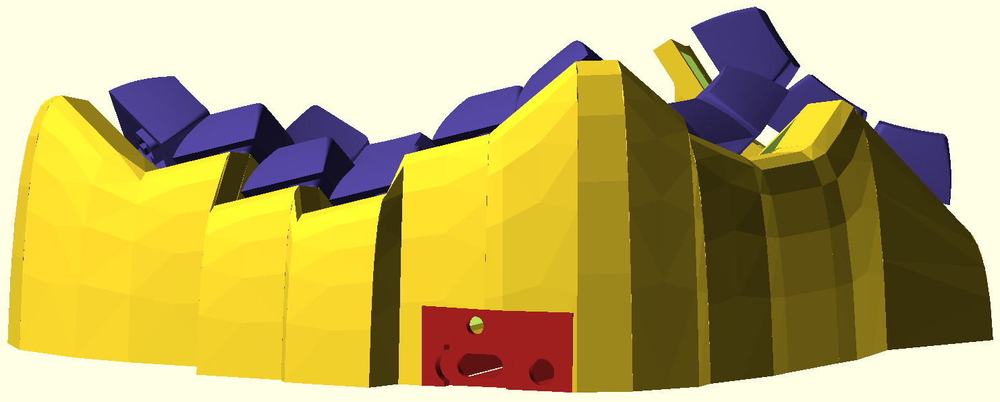
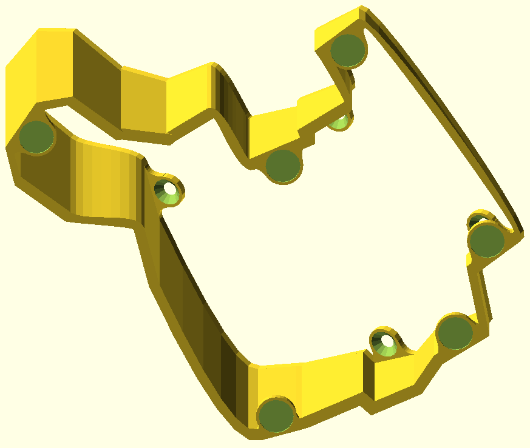

# Dometyl - Another Dactyl inspired keyboard (eventually supporting rubber domes)

## About
This is a library (currently under construction) for generation of paramaterized
split-hand, concave, columnar, ergonomic keyboards in the spirit of the
[Dactyl](https://github.com/adereth/dactyl-keyboard), but written in from the
ground up in [ocaml](https://ocaml.org/), rather than
[clojure](https://clojure.org). **Dometyl** also takes inspiration from a
lineage of **Dactyl-like** keyboards that evolved from the original script,
including the [Compactyl](https://github.com/dereknheiley/dactyl-manuform-tight)
itself a fork of forks of dactyl-manumform keyboards with many accumulated
features, and the [Skeletyl](https://github.com/Bastardkb/Skeletyl), a sleak,
low-profile, open-case design built in
[Fusion360](https://www.autodesk.ca/en/products/fusion-360/overview).

The name **Dometyl** comes from my original mission of creating a
**dactyl/skeletyl-like** board that can be built with rubber dome switches like
[Topre](https://deskthority.net/wiki/Topre_switch) (or
[Niz](https://www.nizkeyboard.com/products/2019-new-niz-ec-switch), whose top
switch housings are available to purchase). The planned switching mechanism
using magnets and cheap hall-effect sensors rather than the typical capacitive
sensor PCBs works as expected in hand (images and video of prototype assembly to
come), however a sturdy enough and relible mounting scheme for dome and sensor
platform to the bottom of the plate is yet to be worked out (WIP parts can be
found in the [Niz module](dometyl/lib/generator/niz.ml)).

In the meantime, the generator works fine for Mx and Choc style switches, so I
am working to improve the documentation and make it a bit more user friendly so
that others can begin to tool around with it.

## Setup
This generator is written in the [ocaml](https://ocaml.org/) language, so you'll
need to get an environment set up, including the package manager
[opam](https://opam.ocaml.org/) and the build system
[dune](https://github.com/ocaml/dune). You'll of course also want
[OpenSCAD](https://openscad.org/) to preview/render/export the generated models.

After installing `opam`, you can run the [setup.sh](setup.sh) script for
convenience, or follow the instructions under the [opam
dependencies](#opam-dependencies) and [Installing Scad_ml](#Installing-Scad_ml)
sub-sections, followed by copying [main.ml.example](dometyl/bin/main.ml.example)
to `dometyl/bin/main.ml`.

### opam dependencies
The other dependencies include the build system
[dune](https://github.com/ocaml/dune),
[base](https://github.com/janestreet/base) and
[stdio](https://github.com/janestreet/stdio) (standard library replacements)
from janestreet, as well as a couple ppx rewriters, all of which are available
through the opam package manager.
* `opam install dune base stdio ppx_jane ppx_inline_test`

### Installing Scad_ml
One day I may get to upstreaming my drammatic changes to
[scad-ml](https://github.com/namachan10777/scad-ml) and do the work to get the
library added to the **opam** repository, but for now, you'll need to clone and
locally install my fork (anywhere, no need to be in your clone of this repo, as
doing this will make it available in your opam switch alogside the packages you
install from the package repository).
1. `git clone https://github.com/geoffder/scad-ml`
2. `cd scad-ml`
3. `dune build`
4. `opam install ./scad_ml.opam`

## Organization
Online documentation is available
[here](https://geoffder.github.io/dometyl-keyboard/dometyl/index.html), and will
be filling in over time.

## Usage
1. If you haven't already, copy [main.ml.example](dometyl/bin/main.ml.example)
   to `dometyl/bin/main.ml` and add a line for writing the scad of your
   generated model to the [things](dometyl/things) directory. This can be done
   simply with the helper function `write_thing` which can also optionally
   export and `.stl` using the OpenSCAD cli. You can also pass your generated
   `Case.t` to tent and bottom plate generation functions while you're there and
   write those to `.scad` as well.
2. Make a new `.ml` file in the [boards library](dometyl/lib/boards), or
   modify and existing one to suit your preferences / fit your hand.
3. Generate scads/stls by running `dune exec @dometyl` from the [dometyl](dometyl)
   project folder. Files will be output to the [things](things) directory.
4. Open generated `.scad` files in OpenSCAD where they can be
   previewed/rendered/exported to `.stl`. If a viewed `.scad` is overwritten by
   compiling and running the generator, the changes will be visible in the GUI.
5. Once you've had success building your board your unique board, and have found
   your new changes to be comfortable (e.g. cool new thumb cluster, tailored
   splays, column tilts, a new look squeezed out of this jank library, etc),
   consider making a PR for your addition to the [boards
   library](dometyl/lib/boards). It would be nice to accumulate a zoo of
   configurations that can serve as jumping off points / inspiration for others.
6. PRs for added/improved functionality in the rest of the library that go
   beyond new combinations of the existing tools are welcomed as well. I know
   that it might be overly optimistic, but I think accumulating improvements and
   variations here rather than having them strewn over countless forks would be
   make for a nice resource!

## More Example Output
* An ugly [recreation](dometyl/lib/boards/skeletyl.ml) (yellow) of the
  [BastardKB Skeletyl](https://github.com/Bastardkb/Skeletyl) (purple).
  
* This mimic configuration can serve as a nice place to start if you like the
  skeletyl, but would like to tweak the column offsets, or would like to (at the
  price of it being a bit taller) use kailh hotswap sockets:
  
* (Mostly) closed [configuration](dometyl/lib/boards/deractyl.ml) with thumb and
  plate based off of the
  [Compactyl](https://github.com/dereknheiley/dactyl-manuform-tight), but with
  the addition of aggresive secondary column tilt. 
* There is also support for using the TRRS/MCU holders from
  
  (reversible, elite-C without and without reset button access) and
  
  (non-reversible, elite-C and pro-micro). Rough placement is done with the help of wall
  coordinates, with offset and rotation parameters available to fine-tune.
  Eventually a more tailored holder should be available, but these existing stls
  can get the job done today.
  
  
* Configurable heat-set insert screw holes (visible in other examples) or
  bumpon feet can be placed at the base of walls of your choosing
  
* Base plate and configurable tent can be generated to fit your case.
  
  
  

## Troubleshooting
Now and then, when you attempt to render a model, part of it will disappear.
This is due to my imperfect abuse of
[OpenSCAD
polyhedrons](https://en.m.wikibooks.org/wiki/OpenSCAD_User_Manual/Primitive_Solids#polyhedron),
which can fail to close when the points on each of their edges are at strange
angles to eachother. The walls (from keyholes to the ground) and the
connections between the walls both use polyhedrons so they are prone to breaking
in this manner.

When this happens, and more than one piece of the case disappears (e.g. all of the
connections between the walls), it can be useful to narrow down which part(s) in
particular caused it, since it isn't necessarily all of them that have gone bad.
To help with this, you can use **Thrown Together** mode in the OpenSCAD GUI
(found in the **View** menu, or activated by hitting **F12**), which will show
pink where you can see into the inside of any shapes (unclosed mesh).

Generally, you should be able to fix the problem by adjusting the parameters
used for drawing the polyhedrons in question. For walls, key values include
`~d1` and `~d2`, which specify how far they extend out from the side of the
plate, `n_steps`, which determines many points are used to draw the bezier
curves that form the edge of the drawn polyhedra, and `n_facets`, which sets how
many faces along the outer and inner sides of the wall there should be. If the
numbers of points are too high, or the curve of the wall is too tight, sometimes
the "bunching up" of points can make the faces difficult to close up. This can
ofter be remedied by increasing the number of facets, as the size of the
triangles generated by CGAL to close the mesh will be smaller / less stretched.
For the perimeter connections, you'll want to look at the various `d` and
`scale` parameters relevant to the one that has broken.

One day, some of these worries may be alleviated as I revisit/improve the
solutions for polyhedron generation that are presently in use, for now, my
apologies if they cause you any grief!

## License
Copyright © 2021 Geoff deRosenroll

The source code for generating the models is distributed under the [GNU AFFERO
GENERAL PUBLIC LICENSE Version 3](LICENSE.md).

The generated models are distributed under the [Creative Commons
Attribution-ShareAlike 4.0 International (CC BY-SA 4.0)](LICENSE-models.md).
