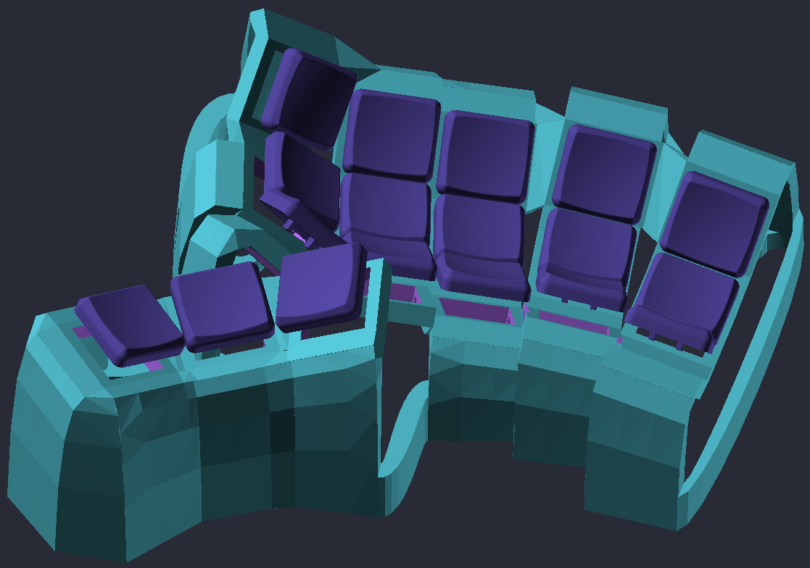

### Bill of Materials
| Part name                                            | Amount |
| -----------------------------------------------------|--------|
| Choc V1 switches of your choice                      | 36     |
| Choc V1 compatible caps                              | 36     |
| Kailh Hotswap Socket (if applicable)                 | 36     |
| Elite-C                                              | 2      |
| Elite-C adapter PCB (>= V1.3) (or printed)           | 2      |
| 1N4148 Diodes (unless direct wiring with enough pins)| 36     |
| Wires (26/28 AWG solid core wire recommended)        | enough |
| 6x3 neodymium magnet                                 | 10x case, 10x tent, 10x plate (optional) |
| 5x1 neodymium magnet (optional, for thinner plate)   | 10x plate |
| Hot glue (for sockets and magnets)                   |        |
| M4 screw insert, (D6.0 X L5.0) or (D5.0 x L4)        | 4      |
| Audio jack, SMD                                      | 2      |
| USB-C cable                                          | 1      |
| TRRS / male-male audio cable                         | 1      |
| Adhesive steel wheel weights (see [**Tent**](#tent)) |        |
| Bumpons / Bumper feet (10x2mm)                       | 12 for plates, 14 for tents |

### Switches / Caps
Designed for Choc V1, and tuned with MBK keycaps in mind (though choc cap
dimensions are likely consistent enough that you don't have to worry about
collisions with others).

### Fasteners
This example has been configured to use 6x3mm magnets (hotglued into place) for
attaching the plate and tenting base. A thinner plate generated for 5x1mm
magnets is provided as an option as well (trading sturdiness for lower height
and less plastic).

### MCU mounting
M4 heatset eyelets and case cutouts are included to fit the BastardKB Elite-C
holder.

### Tent
I recommend attaching adhesive wheel weights around the inside of the tent
(also, maybe in the case especially if you won't be using a tent) to keep it
from tipping/sliding around and make it feel sturdier. Adding some foam should
help mitigate the reverb that comes along with it, and add an extra bit of
weight as well. Example of what this may look like (from a splaytyl build):

