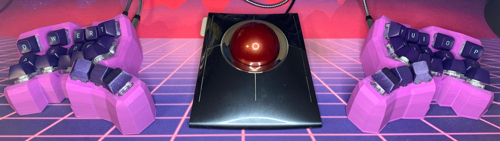
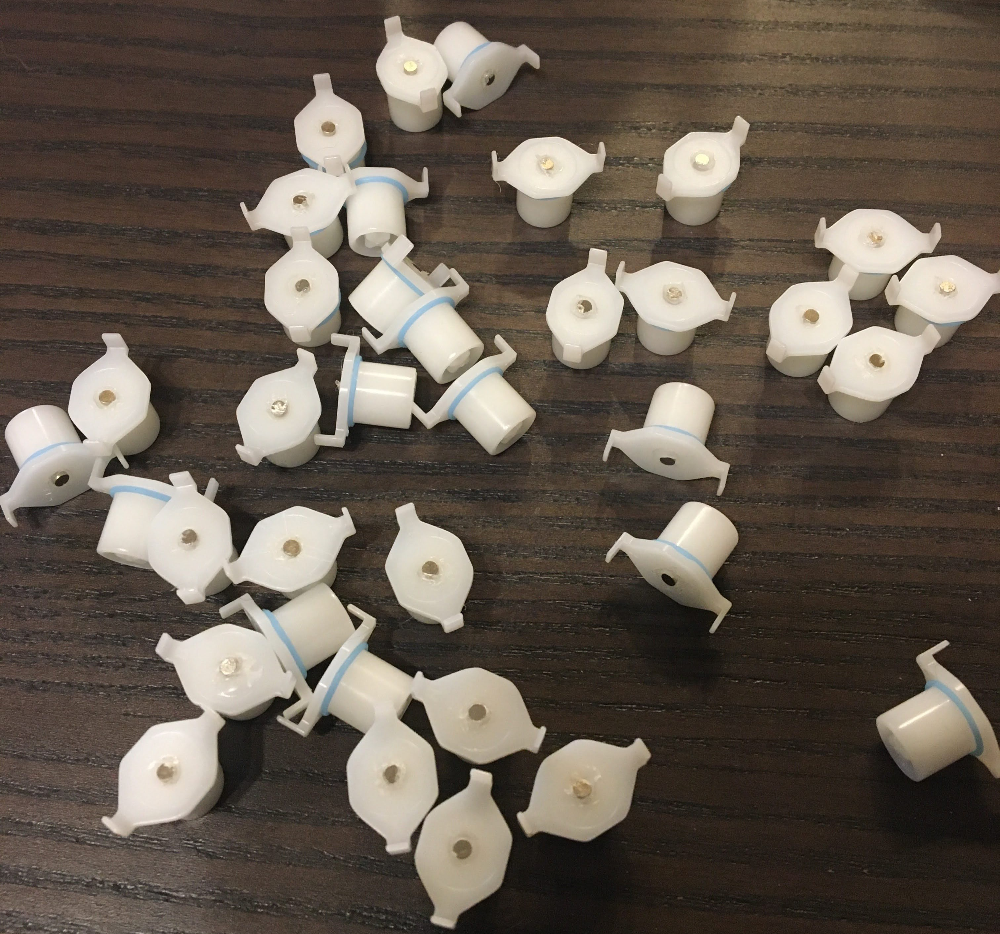
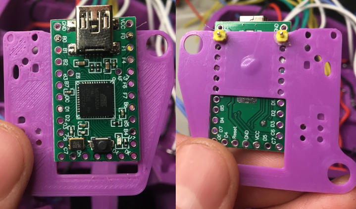
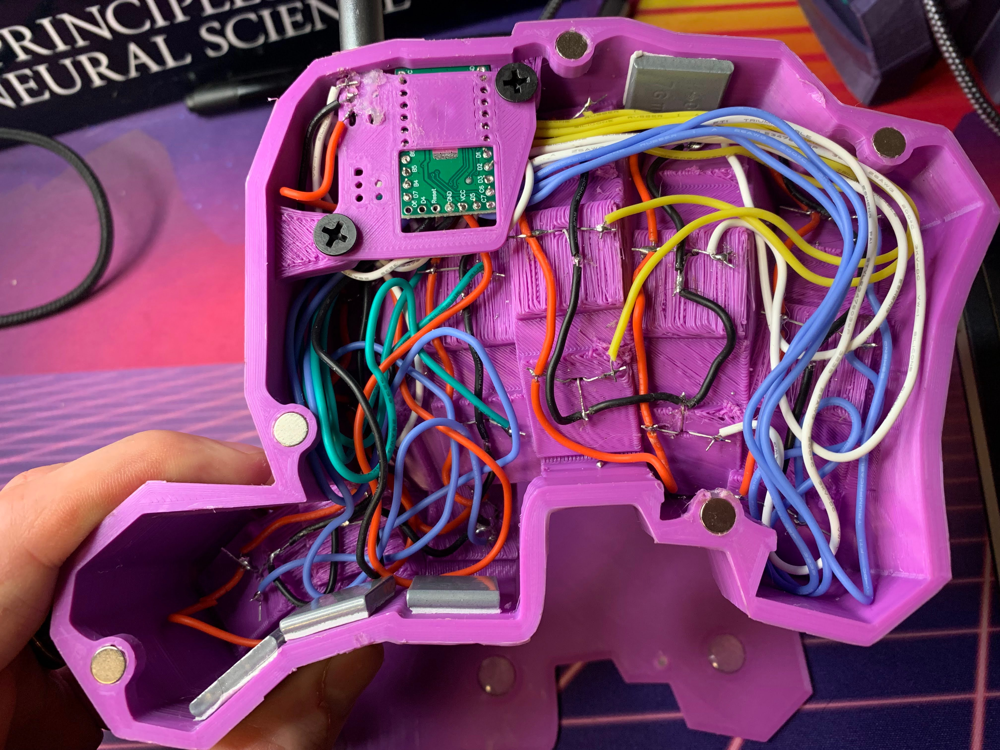

### Bill of Materials
| Part name                                            | Amount |
| -----------------------------------------------------|--------|
| Niz EC switch housings and sliders                   | 36     |
| AH3572 hall effect switches (bulk - straight legs)   | 36     |
| 2x1mm neodymium magnets (mine are Deryun brand)      | 36     |
| Ideally MT3 caps (see [below](#caps))                |        |
| Teensy 2.0                                           | 2      |
| Printed BastardKB shield                             | 2      |
| Wires (26/28 AWG solid core wire recommended)        | enough |
| Hot glue                                             |        |
| M4 8mm Screw                                         | 14     |
| M4 screw insert, (D6.0 X L5.0) or (D5.0 x L4)        | 14     |
| Audio jack, SMD                                      | 2      |
| Micro USB cable                                      | 1      |
| TRRS / male-male audio cable                         | 1      |
| Adhesive steel wheel weights (optional)              |        |
| Bumpons / Bumper feet (10x2mm)                       | 12 for plates, 14 for tents |

### Switches
Some assembly is required for our switches of course. First you will need to
glue the [through-hole hall
sensors](https://www.diodes.com/assets/Datasheets/AH3572.pdf) in to the insets
in the keyholes like so:

Then, hotglue magnets to the bottom of the niz sliders like so:

Some sliders have bumps/nibs inside their spring dimple, and you'll likely want
to melt out the hole a bit with your soldering iron to seat the magnet into the
hole better. The spacing of the magnet to the sensor is important for activation
(and deactivation after hysteresis) distance, thus having relatively consistent
depth of the magnets at this stage is fairly important. Even if you have done
testing (recommended) on a breadboard with individual printed keyholes in
advance to make sure that your magnets have a suitable range with the sensors.
This can help you see if sensor inset depth adjustment (and/or rubber dome
thickness, which affects these distances, and may not match the domes that you
are using particularly well) is required for your printing setup. During your
full build, it may still happen that some angled keyholes end up with suboptimal
actuation distances (printing tolerances etc), but fortunately you will still
likely be able to jank your way out these situations just fine. If for example,
you find that a key has it's deactivation point too close to the top of the stem
travel range, leading to slow key release or failures to release, there are a
couple fixes you can readily try:

1. Check that your sensor is all the way seated into it's inset (not on a thick
layer of glue) by using your iron to heat up the glue, then press down on the
sensor with some tweezers.
2. Melt a bit of more a hole into the stem to glue the magnet in deeper there

### MCU mounting
 M4 heatset eyelets and case cutouts
are included to fit the printable BastardKB shield. As this build is using the
Teensy, which has a bit different dimensions, I attached it to the shield with
the first pins off the end of the board. This way the USB port is able to reach
through the case along with the TRS jack. To line things up, first I soldered
headers into the second set of pins, dabbed glue down in the middle (you can see
where), then placed it down while inserting the pins into the first holes on the
shield.

### Wiring
Wiring should be done using a direct pin scheme, rather than a row/column
matrix.

VCC (red) and ground (black) are wired to to pin 1 (VDD) and 2 (GND), of the
hall sensors respectively. Then, the pin 3 (OUTPUT) of each sensor is wired to
an IO pin of the MCU.

Please ignore the case magnets, use screws instead ([see note
below](#fasteners))! One thing that you might want to copy though, is the
inclusion of adhesive wheel weights, which add some welcome heft, and in
combination bumpons on the base plate, keep things from sliding around.

### Fasteners
As you can see in the build images, I made my first one with 6x3 magnets in the
case, with thinner 5x1 magnets in the plate. From small scale testing I didn't
think this was going to be a problem, so since I wanted to try out using magnets
(having added the option since my first build of the splaytyl) I went ahead with
them rather than screws and heatset inserts. Unfortunately, at scale with all of
the strong magnets, and the proximity of some to the keyholes, they can indeed
bias the sensors and mess with actuation distances and hysteresis. Thus, I
strongly recommend that you do as I say, and not as I do, and use screws (the
STLs here have eyelets/holes for inserts and countersunk M4s). These can be a
bit tough to access in the included 30 degree tent, but personally succeeded
after some frustration when I build my first **splaytyl**.

### Caps
The column curvatures of this configuration are made with Niz housings and MT3
caps in mind, taller caps (like SA) may collide.

### Tent
See the **Tent** section in the [splaytyl build notes](../splaytyl/README.md)
